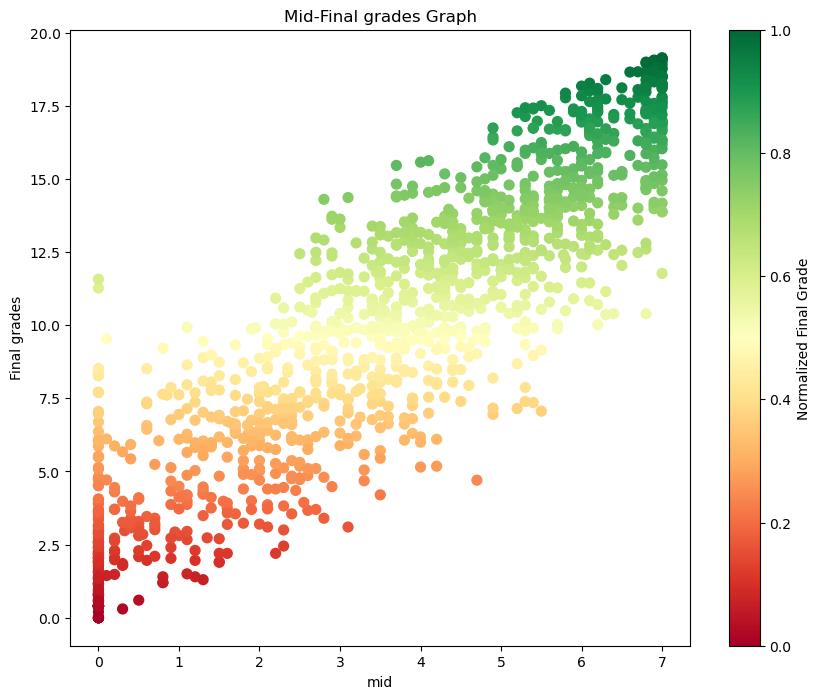
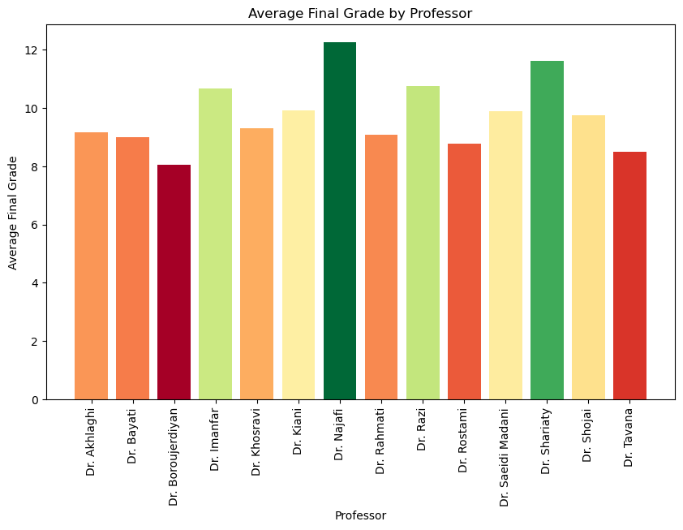
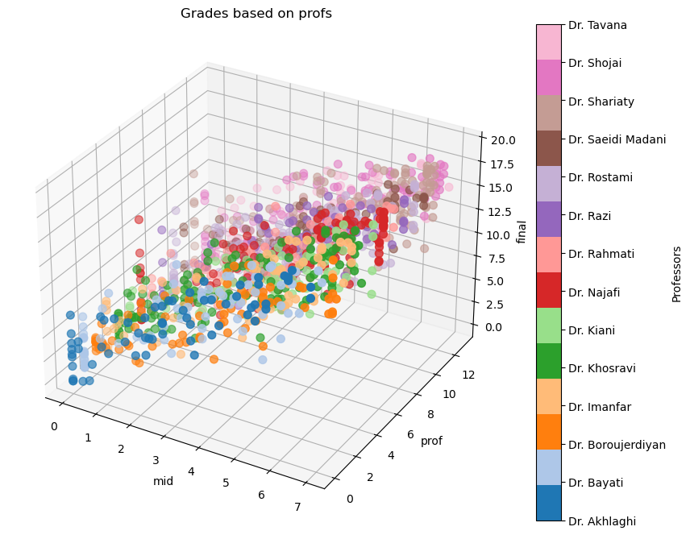
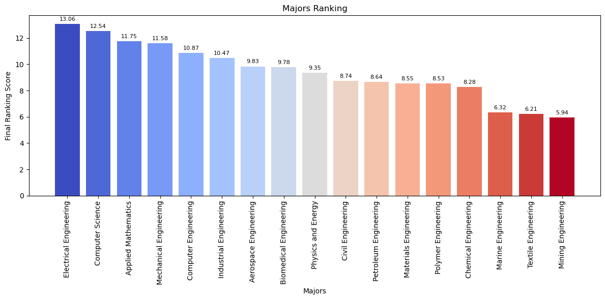
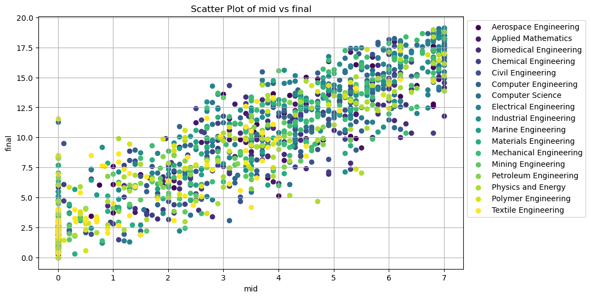
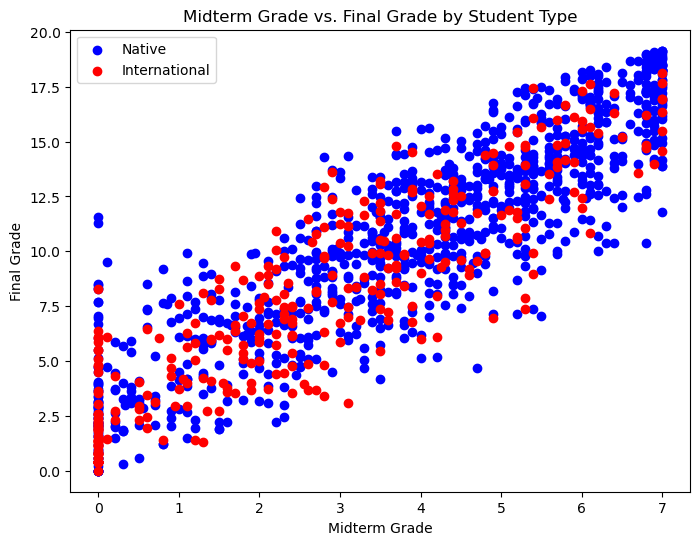
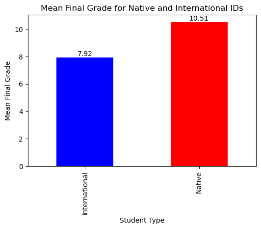
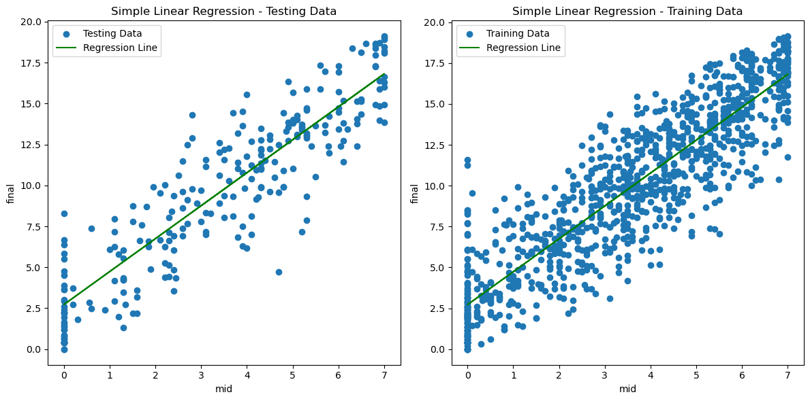
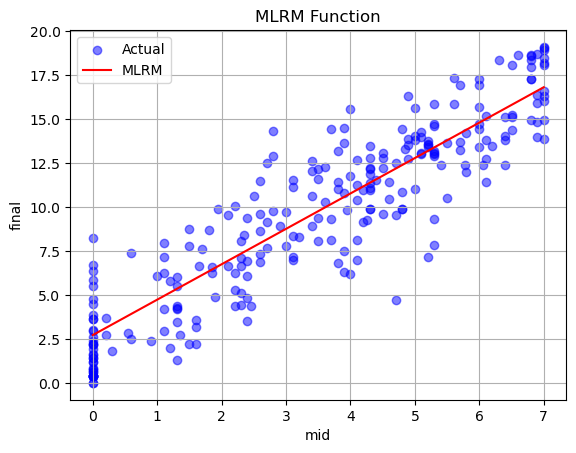

<h2 style="text-align: center;">Exploring Academic Performance in General Mathematics 1</h2>
<h3 style="text-align: center;">A Case Study of Students at AmirKabir University of Technology</h3>
<h4 style="text-align: center;">by Koorosh Komeilizadeh</h4>

<div style="text-align: center;">
  <a href="mailto:kkomeilizadeh@gmail.com" target="_blank">
    <i class="fa fa-envelope" style="font-size: 24px; color: #808080;"></i>
  </a>
  &nbsp;&nbsp;&nbsp;
  <a href="https://kooroshkz.com/" target="_blank">
    <i class="fa fa-globe" style="font-size: 24px; color: #808080;"></i>
  </a>
  &nbsp;&nbsp;&nbsp;
  <a href="https://github.com/kooroshkz" target="_blank">
    <i class="fa fa-github" style="font-size: 24px; color: #808080;"></i>
  </a>
  &nbsp;&nbsp;&nbsp;
  <a href="https://www.linkedin.com/in/kooroshkz/" target="_blank">
    <i class="fa fa-linkedin" style="font-size: 24px; color: #808080;"></i>
  </a>
</div>

## Project Introduction
<p>In this project, our primary objective is to conduct a meticulous analysis of student and instructor performance during the grading process for General Mathematics 1 at AmirKabir University of Technology for the 1401 academic year. Leveraging a dataset generously provided by the esteemed Faculty of Mathematics and Computer Science, we will employ advanced data retrieval and cleaning techniques to ensure data accuracy and consistency. By scrutinizing the information meticulously, we aim to discern insightful trends and patterns that can shed light on the efficacy of the grading system and identify areas for potential improvement. Our findings will serve as a valuable resource for enhancing the overall educational experience and fostering an environment of academic excellence at the university.</p>

### Project Contributors
**[Koorosh Komeilizadeh](https://www.linkedin.com/in/kooroshkz/)** - Author and Analyst <br>
DSAI Undergraduate Student at Leiden University

**[Behzad Najafi Saghezchi](https://aut.ac.ir/cv/2105/BEHZAD%20NAJAFI%20SAGHEZCHI)** - Reviewer <br>
Assistant Professor at AmirKabir University of Technology

**[Farzad Didehvar](https://aut.ac.ir/cv/2125/Farzad%20Didehvar)** - Reviewer <br>
Assistant Professor at AmirKabir University of Technology


## Outlines
- [1 Preview](#Preview)
    - [&nbsp;&nbsp;1.1 Dataset](#Dataset)
    - [&nbsp;&nbsp;1.2 Goals](#Goals)
    - [&nbsp;&nbsp;1.3 Tools](#Tools)
    - [&nbsp;&nbsp;1.4 Author and Analyst](#bio)
- [2 Data Processing](#Data_Processing)
    - [&nbsp;&nbsp;2.1 Import Data](#importdata)
    - [&nbsp;&nbsp;2.2 Data Cleaning](#clean)
    - [&nbsp;&nbsp;2.2 Data Output to CSV](#csvout)
- [3 Data Visualization](#visual)
    - [&nbsp;&nbsp;3.1 Data Overview](#Overview)
    - [&nbsp;&nbsp;3.2 Grades by Professors](#gradbyp)
- [4 Correlation of Clusters with Grades](#stu)
    - [&nbsp;&nbsp;4.1 Correlation between majors and grades](#major)
    - [&nbsp;&nbsp;4.2 Mean math grades for majors](#mean)
    - [&nbsp;&nbsp;4.3 Majors on Mid-Final Plot](#mmf)
    - [&nbsp;&nbsp;4.3 Native and International Students](#int)
- [5 Machine Learning Model](#ml)
    - [&nbsp;&nbsp;5.1 Data Processing](#mldp)
    - [&nbsp;&nbsp;5.2 Simple Linear Regression Model](#slrm)
    - [&nbsp;&nbsp;5.3 Multi Linear Regression Model](#mlrm)
- [6 Conclusion ](#end)
    - [&nbsp;&nbsp;6.1 Project results](#results)
    - [&nbsp;&nbsp;6.2 Answer to goals](#goalansw)
    - [&nbsp;&nbsp;6.3 Further researches ](#more)
    - [&nbsp;&nbsp;6.4 Contact ane update project ](#updt)

<a name="Preview"></a>
## 1- Preview

<a name="Dataset"></a>
### 1.1 Dataset
The Faculty of Mathematics and Computer Science at AmirKabir University of Technology provides reports in Excel format, transparently disclosing students' detailed grades for each semester. Our objective is to import this data into a data frame, perform data cleaning, and eliminate any outliers to conduct appropriate data analysis. The dataset pertains to General Mathematics 1 for the 1401 academic year at AmirKabir University of Technology
<br><br>
###### The meticulously cleaned and meticulously processed dataset for this project is readily accessible on Kaggle.
[General Mathematics 1 Student grades at AUT](https://www.kaggle.com/datasets/kooroshkz/general-mathematics-1-student-grades-at-aut)


<a name="Goals"></a>
### 1.2 Goals
    - Understanding Grade Distribution of Students.
    - Exploring the Correlation between Instructors and Average Grades.
    - Investigating the Relationship Between Students' Majors and Grade Status.
    - Finding the relationships between international and native students' grades.
    - Predicting Final Grades based on Midterm and Homework Scores.
    - Providing a Clean Dataset of Grades for Future Research Purposes.

<a name="Tools"></a>
### 1.3 Tools
 - ##### Pandas
Utilized to convert the data into a data frame format, enabling efficient data cleaning and storage.
 - ##### Numpy
     Employed for advanced mathematical functions and array operations.
 - ##### Matplotlib
     Used for data visualization and generating various types of plots and graphs to better understand the data.
 - ##### Scikit-learn
     Applied to develop Linear regression models for predictive analysis and Encoding Labels for non-numeric datas
     

<a name="bio"></a>
### 1.4 Author and Analyst

#### Koorosh Komeilizadeh 
##### Data Science and Artificial Intelligence <br>undergraduate student at Leiden University

Passionate Data Science & AI student with expertise in Python, Machine Learning, and Data Analysis. Eager to explore innovative applications of AI and committed to driving data-driven solutions for impactful research.

Email : kkomeilizadeh@gmail.com<br>Website : <a href="https://kooroshkz.com">www.kooroshkz.com</a><br>Github & LinkedIn : kooroshkz

<a name="Data_Processing"></a>
## 2- Data Processing

Data processing is a crucial step in data analysis that plays a pivotal role in ensuring the accuracy, reliability, and meaningfulness of the results. In any data-driven project, raw data often contains noise, inconsistencies, and missing values, making it challenging to draw insightful conclusions directly. Data processing involves a series of techniques, such as data cleaning, transformation, integration, and normalization, aimed at refining the raw data into a usable and consistent format. By addressing data quality issues, data processing enhances the integrity of the analysis, reduces bias, and enables more robust statistical methods. 

<a name="importdata"></a>
### 2.1 Import Data

#### Pandas

Pandas is a popular Python library widely used for data manipulation and analysis. It provides powerful data structures and functions to efficiently work with structured data. One of its core data structures is the DataFrame, which is essentially a two-dimensional, labeled data structure resembling a table or spreadsheet. The DataFrame allows data to be organized in rows and columns, where each column can have a specific data type. It is versatile and can handle different types of data, including CSV, JSON, SQL databases, and Excel files.


```python
import pandas as pd
```


```python
# Read all sheets from the "grades.xlsx" Excel file into a dictionary of DataFrames
all_sheets = pd.read_excel("grades.xlsx", sheet_name=None)

# Concatenate all DataFrames in the dictionary into a single DataFrame
merged_df = pd.concat(all_sheets.values(), ignore_index=True)
```


```python
# Shows a preview of DataFrame
merged_df
```

<table border="1" class="dataframe">
  <thead>
    <tr style="text-align: right;">
      <th></th>
      <th>گروه درس</th>
      <th>شماره دانشجو</th>
      <th>تکلیف1</th>
      <th>تکلیف2</th>
      <th>تکلیف3</th>
      <th>تکلیف4</th>
      <th>تکلیف5</th>
      <th>تکلیف6</th>
      <th>تکلیف7</th>
      <th>تکلیف8</th>
      <th>...</th>
      <th>پایانترم از 9</th>
      <th>میانترم از7</th>
      <th>نهایی 1</th>
      <th>پایانترم از13</th>
      <th>میانترم از3</th>
      <th>نهایی2</th>
      <th>نمره تدریس یار</th>
      <th>کلاسی استاد</th>
      <th>ماکسیمم</th>
      <th>استاد</th>
    </tr>
  </thead>
  <tbody>
    <tr>
      <th>0</th>
      <td>1</td>
      <td>40027008</td>
      <td>40.0</td>
      <td>33.0</td>
      <td>0.0</td>
      <td>35.0</td>
      <td>40.0</td>
      <td>40</td>
      <td>35</td>
      <td>0.0</td>
      <td>...</td>
      <td>0.5</td>
      <td>2.2</td>
      <td>4.93</td>
      <td>0.722222</td>
      <td>0.942857</td>
      <td>3.895079</td>
      <td>NaN</td>
      <td>NaN</td>
      <td>4.930000</td>
      <td>دکتر کیانی</td>
    </tr>
    <tr>
      <th>1</th>
      <td>1</td>
      <td>40113901</td>
      <td>37.0</td>
      <td>33.0</td>
      <td>38.0</td>
      <td>0.0</td>
      <td>40.0</td>
      <td>40</td>
      <td>40</td>
      <td>40.0</td>
      <td>...</td>
      <td>3.0</td>
      <td>3.1</td>
      <td>8.78</td>
      <td>4.333333</td>
      <td>1.328571</td>
      <td>8.341905</td>
      <td>NaN</td>
      <td>NaN</td>
      <td>8.780000</td>
      <td>دکتر کیانی</td>
    </tr>
    <tr>
      <th>2</th>
      <td>1</td>
      <td>40122045</td>
      <td>24.0</td>
      <td>32.0</td>
      <td>40.0</td>
      <td>20.0</td>
      <td>15.0</td>
      <td>40</td>
      <td>35</td>
      <td>18.0</td>
      <td>...</td>
      <td>1.0</td>
      <td>4.3</td>
      <td>7.54</td>
      <td>1.444444</td>
      <td>1.842857</td>
      <td>5.527302</td>
      <td>NaN</td>
      <td>NaN</td>
      <td>7.540000</td>
      <td>دکتر کیانی</td>
    </tr>
    <tr>
      <th>3</th>
      <td>1</td>
      <td>40122046</td>
      <td>0.0</td>
      <td>36.0</td>
      <td>40.0</td>
      <td>40.0</td>
      <td>40.0</td>
      <td>40</td>
      <td>35</td>
      <td>40.0</td>
      <td>...</td>
      <td>1.9</td>
      <td>0.1</td>
      <td>4.71</td>
      <td>2.744444</td>
      <td>0.042857</td>
      <td>5.497302</td>
      <td>NaN</td>
      <td>NaN</td>
      <td>5.497302</td>
      <td>دکتر کیانی</td>
    </tr>
    <tr>
      <th>4</th>
      <td>1</td>
      <td>40122047</td>
      <td>0.0</td>
      <td>0.0</td>
      <td>0.0</td>
      <td>0.0</td>
      <td>0.0</td>
      <td>40</td>
      <td>0</td>
      <td>0.0</td>
      <td>...</td>
      <td>0.0</td>
      <td>1.1</td>
      <td>1.50</td>
      <td>0.000000</td>
      <td>0.471429</td>
      <td>0.871429</td>
      <td>NaN</td>
      <td>NaN</td>
      <td>1.500000</td>
      <td>دکتر کیانی</td>
    </tr>
    <tr>
      <th>...</th>
      <td>...</td>
      <td>...</td>
      <td>...</td>
      <td>...</td>
      <td>...</td>
      <td>...</td>
      <td>...</td>
      <td>...</td>
      <td>...</td>
      <td>...</td>
      <td>...</td>
      <td>...</td>
      <td>...</td>
      <td>...</td>
      <td>...</td>
      <td>...</td>
      <td>...</td>
      <td>...</td>
      <td>...</td>
      <td>...</td>
      <td>...</td>
    </tr>
    <tr>
      <th>1276</th>
      <td>19</td>
      <td>40132012</td>
      <td>0.0</td>
      <td>40.0</td>
      <td>40.0</td>
      <td>36.0</td>
      <td>35.0</td>
      <td>0</td>
      <td>35</td>
      <td>22.0</td>
      <td>...</td>
      <td>3.5</td>
      <td>3.9</td>
      <td>9.48</td>
      <td>5.055556</td>
      <td>1.671429</td>
      <td>8.806984</td>
      <td>NaN</td>
      <td>NaN</td>
      <td>9.480000</td>
      <td>دکترشریعتی</td>
    </tr>
    <tr>
      <th>1277</th>
      <td>19</td>
      <td>40132013</td>
      <td>25.0</td>
      <td>20.0</td>
      <td>20.0</td>
      <td>37.0</td>
      <td>40.0</td>
      <td>40</td>
      <td>40</td>
      <td>0.0</td>
      <td>...</td>
      <td>6.3</td>
      <td>0.0</td>
      <td>8.52</td>
      <td>9.100000</td>
      <td>0.000000</td>
      <td>11.320000</td>
      <td>NaN</td>
      <td>NaN</td>
      <td>11.320000</td>
      <td>دکترشریعتی</td>
    </tr>
    <tr>
      <th>1278</th>
      <td>19</td>
      <td>40132021</td>
      <td>40.0</td>
      <td>34.0</td>
      <td>40.0</td>
      <td>40.0</td>
      <td>40.0</td>
      <td>40</td>
      <td>40</td>
      <td>40.0</td>
      <td>...</td>
      <td>8.6</td>
      <td>5.6</td>
      <td>17.34</td>
      <td>12.422222</td>
      <td>2.400000</td>
      <td>17.962222</td>
      <td>NaN</td>
      <td>NaN</td>
      <td>17.962222</td>
      <td>دکترشریعتی</td>
    </tr>
    <tr>
      <th>1279</th>
      <td>19</td>
      <td>40132033</td>
      <td>0.0</td>
      <td>0.0</td>
      <td>40.0</td>
      <td>38.0</td>
      <td>35.0</td>
      <td>40</td>
      <td>40</td>
      <td>0.0</td>
      <td>...</td>
      <td>5.8</td>
      <td>2.3</td>
      <td>10.03</td>
      <td>8.377778</td>
      <td>0.985714</td>
      <td>11.293492</td>
      <td>NaN</td>
      <td>NaN</td>
      <td>11.293492</td>
      <td>دکترشریعتی</td>
    </tr>
    <tr>
      <th>1280</th>
      <td>19</td>
      <td>40132048</td>
      <td>37.0</td>
      <td>39.0</td>
      <td>38.0</td>
      <td>38.0</td>
      <td>35.0</td>
      <td>40</td>
      <td>40</td>
      <td>40.0</td>
      <td>...</td>
      <td>8.5</td>
      <td>0.0</td>
      <td>11.57</td>
      <td>12.277778</td>
      <td>0.000000</td>
      <td>15.347778</td>
      <td>NaN</td>
      <td>NaN</td>
      <td>15.347778</td>
      <td>دکترشریعتی</td>
    </tr>
  </tbody>
</table>
<p>1281 rows × 28 columns</p>
</div>


<a name="clean"></a>
### 2.2 Data Cleaning
Data cleaning is a critical phase aimed at enhancing the quality and reliability of the dataset. This process involves identifying and rectifying errors, inconsistencies, and missing values present in the raw data. By employing techniques such as outlier detection, handling missing data, and resolving discrepancies, data cleaning ensures that the dataset is accurate, complete, and consistent. Moreover, it plays a crucial role in preparing the data for analysis, preventing misleading or biased results. Through meticulous data cleaning, my project aims to lay a solid foundation for insightful data analysis and ultimately make well-informed decisions based on trustworthy and dependable data.


```python
# Get a list of all column names in the DataFrame
columns = merged_df.columns.tolist()

# Define a list of column names that you want to drop
extra_columns = columns[0:1] + columns[10:19] + columns[21:-1]

# Drop the columns specified in the `extra_columns` list from the DataFrame
merged_df.drop(extra_columns, axis=1, inplace=True)
```


```python
merged_df
```


<table border="1" class="dataframe">
  <thead>
    <tr style="text-align: right;">
      <th></th>
      <th>شماره دانشجو</th>
      <th>تکلیف1</th>
      <th>تکلیف2</th>
      <th>تکلیف3</th>
      <th>تکلیف4</th>
      <th>تکلیف5</th>
      <th>تکلیف6</th>
      <th>تکلیف7</th>
      <th>تکلیف8</th>
      <th>میانترم از7</th>
      <th>نهایی 1</th>
      <th>استاد</th>
    </tr>
  </thead>
  <tbody>
    <tr>
      <th>0</th>
      <td>40027008</td>
      <td>40.0</td>
      <td>33.0</td>
      <td>0.0</td>
      <td>35.0</td>
      <td>40.0</td>
      <td>40</td>
      <td>35</td>
      <td>0.0</td>
      <td>2.2</td>
      <td>4.93</td>
      <td>دکتر کیانی</td>
    </tr>
    <tr>
      <th>1</th>
      <td>40113901</td>
      <td>37.0</td>
      <td>33.0</td>
      <td>38.0</td>
      <td>0.0</td>
      <td>40.0</td>
      <td>40</td>
      <td>40</td>
      <td>40.0</td>
      <td>3.1</td>
      <td>8.78</td>
      <td>دکتر کیانی</td>
    </tr>
    <tr>
      <th>2</th>
      <td>40122045</td>
      <td>24.0</td>
      <td>32.0</td>
      <td>40.0</td>
      <td>20.0</td>
      <td>15.0</td>
      <td>40</td>
      <td>35</td>
      <td>18.0</td>
      <td>4.3</td>
      <td>7.54</td>
      <td>دکتر کیانی</td>
    </tr>
    <tr>
      <th>3</th>
      <td>40122046</td>
      <td>0.0</td>
      <td>36.0</td>
      <td>40.0</td>
      <td>40.0</td>
      <td>40.0</td>
      <td>40</td>
      <td>35</td>
      <td>40.0</td>
      <td>0.1</td>
      <td>4.71</td>
      <td>دکتر کیانی</td>
    </tr>
    <tr>
      <th>4</th>
      <td>40122047</td>
      <td>0.0</td>
      <td>0.0</td>
      <td>0.0</td>
      <td>0.0</td>
      <td>0.0</td>
      <td>40</td>
      <td>0</td>
      <td>0.0</td>
      <td>1.1</td>
      <td>1.50</td>
      <td>دکتر کیانی</td>
    </tr>
    <tr>
      <th>...</th>
      <td>...</td>
      <td>...</td>
      <td>...</td>
      <td>...</td>
      <td>...</td>
      <td>...</td>
      <td>...</td>
      <td>...</td>
      <td>...</td>
      <td>...</td>
      <td>...</td>
      <td>...</td>
    </tr>
    <tr>
      <th>1276</th>
      <td>40132012</td>
      <td>0.0</td>
      <td>40.0</td>
      <td>40.0</td>
      <td>36.0</td>
      <td>35.0</td>
      <td>0</td>
      <td>35</td>
      <td>22.0</td>
      <td>3.9</td>
      <td>9.48</td>
      <td>دکترشریعتی</td>
    </tr>
    <tr>
      <th>1277</th>
      <td>40132013</td>
      <td>25.0</td>
      <td>20.0</td>
      <td>20.0</td>
      <td>37.0</td>
      <td>40.0</td>
      <td>40</td>
      <td>40</td>
      <td>0.0</td>
      <td>0.0</td>
      <td>8.52</td>
      <td>دکترشریعتی</td>
    </tr>
    <tr>
      <th>1278</th>
      <td>40132021</td>
      <td>40.0</td>
      <td>34.0</td>
      <td>40.0</td>
      <td>40.0</td>
      <td>40.0</td>
      <td>40</td>
      <td>40</td>
      <td>40.0</td>
      <td>5.6</td>
      <td>17.34</td>
      <td>دکترشریعتی</td>
    </tr>
    <tr>
      <th>1279</th>
      <td>40132033</td>
      <td>0.0</td>
      <td>0.0</td>
      <td>40.0</td>
      <td>38.0</td>
      <td>35.0</td>
      <td>40</td>
      <td>40</td>
      <td>0.0</td>
      <td>2.3</td>
      <td>10.03</td>
      <td>دکترشریعتی</td>
    </tr>
    <tr>
      <th>1280</th>
      <td>40132048</td>
      <td>37.0</td>
      <td>39.0</td>
      <td>38.0</td>
      <td>38.0</td>
      <td>35.0</td>
      <td>40</td>
      <td>40</td>
      <td>40.0</td>
      <td>0.0</td>
      <td>11.57</td>
      <td>دکترشریعتی</td>
    </tr>
  </tbody>
</table>
<p>1281 rows × 12 columns</p>
</div>


```python
#Rename headers
merged_df.columns = ["ID"] + [f"HW{x}" for x in range(1,9)] + ["mid", "final", "prof"]
```


```python
# Fix duplicate prof name error
merged_df.replace("دکترخسروی", "دکتر خسروی", inplace=True)
merged_df.replace("شجاعی", "دکترشجاعی", inplace=True)
```


```python
# Define a dictionary of prof names in Farsi and English
prof_names = {
    "دکتر ایمانفر": "Dr. Imanfar",
    "دکتر خسروی": "Dr. Khosravi",
    "دکتر رحمتی": "Dr. Rahmati",
    "دکتر رستمی": "Dr. Rostami",
    "دکتر نجفی": "Dr. Najafi",
    "دکتر کیانی": "Dr. Kiani",
    "دکتراخلاقی": "Dr. Akhlaghi",
    "دکتربروجردیان": "Dr. Boroujerdiyan",
    "دکتربیاتی": "Dr. Bayati",
    "دکترتوانا": "Dr. Tavana",
    "دکتررضی": "Dr. Razi",
    "دکترسعیدی مدنی": "Dr. Saeidi Madani",
    "دکترشجاعی": "Dr. Shojai",
    "دکترشریعتی": "Dr. Shariaty"
}

# Rename instructors names to English
merged_df["prof"] = merged_df["prof"].replace(prof_names)
```

#### Label encoding

Label Encoding in scikit-learn is a method used to convert categorical data into numerical format. It assigns a unique integer to each category, making it compatible with machine learning algorithms that require numeric inputs. However, be cautious with ordinal assumptions, and consider One-Hot Encoding for certain scenarios.


```python
from sklearn.preprocessing import LabelEncoder

# Create a LabelEncoder object
label_encoder = LabelEncoder()

# Use the LabelEncoder to encode the 'prof' column in the DataFrame
merged_df['prof'] = label_encoder.fit_transform(merged_df['prof'])

# Create a dictionary to map the original categorical labels to their corresponding encoded numbers
encoded_dict = {label: index for index, label in enumerate(label_encoder.classes_)}

# Convert the dictionary to a DataFrame for easier inspection and further use
encoded_dict = pd.DataFrame(encoded_dict.items(), columns=['profname', 'Encoded number'])
```


```python
# A transposed shape of profnames DataFrame
encoded_dict.T
```


<table border="1" class="dataframe">
  <thead>
    <tr style="text-align: right;">
      <th></th>
      <th>0</th>
      <th>1</th>
      <th>2</th>
      <th>3</th>
      <th>4</th>
      <th>5</th>
      <th>6</th>
      <th>7</th>
      <th>8</th>
      <th>9</th>
      <th>10</th>
      <th>11</th>
      <th>12</th>
      <th>13</th>
    </tr>
  </thead>
  <tbody>
    <tr>
      <th>profname</th>
      <td>Dr. Akhlaghi</td>
      <td>Dr. Bayati</td>
      <td>Dr. Boroujerdiyan</td>
      <td>Dr. Imanfar</td>
      <td>Dr. Khosravi</td>
      <td>Dr. Kiani</td>
      <td>Dr. Najafi</td>
      <td>Dr. Rahmati</td>
      <td>Dr. Razi</td>
      <td>Dr. Rostami</td>
      <td>Dr. Saeidi Madani</td>
      <td>Dr. Shariaty</td>
      <td>Dr. Shojai</td>
      <td>Dr. Tavana</td>
    </tr>
    <tr>
      <th>Encoded number</th>
      <td>0</td>
      <td>1</td>
      <td>2</td>
      <td>3</td>
      <td>4</td>
      <td>5</td>
      <td>6</td>
      <td>7</td>
      <td>8</td>
      <td>9</td>
      <td>10</td>
      <td>11</td>
      <td>12</td>
      <td>13</td>
    </tr>
  </tbody>
</table>
</div>


Drop rows with any non-numeric values and reset the indexes.


```python
# Convert all columns of the DataFrame to numeric type
# If any non-numeric values are encountered, they will be converted to NaN (Not a Number)
merged_df = merged_df.apply(pd.to_numeric, errors='coerce')

# Drop rows containing NaN values (rows with non-numeric data)
merged_df = merged_df.dropna()

# Reset the index of the DataFrame after dropping rows with NaN values
merged_df.reset_index(drop=True, inplace=True)

```


```python
cleaned_df = merged_df
cleaned_df
```


<table border="1" class="dataframe">
  <thead>
    <tr style="text-align: right;">
      <th></th>
      <th>ID</th>
      <th>HW1</th>
      <th>HW2</th>
      <th>HW3</th>
      <th>HW4</th>
      <th>HW5</th>
      <th>HW6</th>
      <th>HW7</th>
      <th>HW8</th>
      <th>mid</th>
      <th>final</th>
      <th>prof</th>
    </tr>
  </thead>
  <tbody>
    <tr>
      <th>0</th>
      <td>40027008</td>
      <td>40.0</td>
      <td>33.0</td>
      <td>0.0</td>
      <td>35.0</td>
      <td>40.0</td>
      <td>40</td>
      <td>35.0</td>
      <td>0.0</td>
      <td>2.2</td>
      <td>4.93</td>
      <td>5</td>
    </tr>
    <tr>
      <th>1</th>
      <td>40113901</td>
      <td>37.0</td>
      <td>33.0</td>
      <td>38.0</td>
      <td>0.0</td>
      <td>40.0</td>
      <td>40</td>
      <td>40.0</td>
      <td>40.0</td>
      <td>3.1</td>
      <td>8.78</td>
      <td>5</td>
    </tr>
    <tr>
      <th>2</th>
      <td>40122045</td>
      <td>24.0</td>
      <td>32.0</td>
      <td>40.0</td>
      <td>20.0</td>
      <td>15.0</td>
      <td>40</td>
      <td>35.0</td>
      <td>18.0</td>
      <td>4.3</td>
      <td>7.54</td>
      <td>5</td>
    </tr>
    <tr>
      <th>3</th>
      <td>40122046</td>
      <td>0.0</td>
      <td>36.0</td>
      <td>40.0</td>
      <td>40.0</td>
      <td>40.0</td>
      <td>40</td>
      <td>35.0</td>
      <td>40.0</td>
      <td>0.1</td>
      <td>4.71</td>
      <td>5</td>
    </tr>
    <tr>
      <th>4</th>
      <td>40122047</td>
      <td>0.0</td>
      <td>0.0</td>
      <td>0.0</td>
      <td>0.0</td>
      <td>0.0</td>
      <td>40</td>
      <td>0.0</td>
      <td>0.0</td>
      <td>1.1</td>
      <td>1.50</td>
      <td>5</td>
    </tr>
    <tr>
      <th>...</th>
      <td>...</td>
      <td>...</td>
      <td>...</td>
      <td>...</td>
      <td>...</td>
      <td>...</td>
      <td>...</td>
      <td>...</td>
      <td>...</td>
      <td>...</td>
      <td>...</td>
      <td>...</td>
    </tr>
    <tr>
      <th>1267</th>
      <td>40132012</td>
      <td>0.0</td>
      <td>40.0</td>
      <td>40.0</td>
      <td>36.0</td>
      <td>35.0</td>
      <td>0</td>
      <td>35.0</td>
      <td>22.0</td>
      <td>3.9</td>
      <td>9.48</td>
      <td>11</td>
    </tr>
    <tr>
      <th>1268</th>
      <td>40132013</td>
      <td>25.0</td>
      <td>20.0</td>
      <td>20.0</td>
      <td>37.0</td>
      <td>40.0</td>
      <td>40</td>
      <td>40.0</td>
      <td>0.0</td>
      <td>0.0</td>
      <td>8.52</td>
      <td>11</td>
    </tr>
    <tr>
      <th>1269</th>
      <td>40132021</td>
      <td>40.0</td>
      <td>34.0</td>
      <td>40.0</td>
      <td>40.0</td>
      <td>40.0</td>
      <td>40</td>
      <td>40.0</td>
      <td>40.0</td>
      <td>5.6</td>
      <td>17.34</td>
      <td>11</td>
    </tr>
    <tr>
      <th>1270</th>
      <td>40132033</td>
      <td>0.0</td>
      <td>0.0</td>
      <td>40.0</td>
      <td>38.0</td>
      <td>35.0</td>
      <td>40</td>
      <td>40.0</td>
      <td>0.0</td>
      <td>2.3</td>
      <td>10.03</td>
      <td>11</td>
    </tr>
    <tr>
      <th>1271</th>
      <td>40132048</td>
      <td>37.0</td>
      <td>39.0</td>
      <td>38.0</td>
      <td>38.0</td>
      <td>35.0</td>
      <td>40</td>
      <td>40.0</td>
      <td>40.0</td>
      <td>0.0</td>
      <td>11.57</td>
      <td>11</td>
    </tr>
  </tbody>
</table>
<p>1272 rows × 12 columns</p>
</div>


<a name="csvout"></a>
### 2.2 Data Output to CSV


```python
# Save the cleaned DataFrame to a CSV file
cleaned_df.to_csv('data_sets/grades.csv', index=False)

# Save the DataFrame containing the encoded mapping to a CSV file
encoded_dict.to_csv('data_sets/prof_dict.csv', index=False)
```

<a name="visual"></a>
## 3- Data Visualization
Data visualization is a crucial aspect of data analysis, where complex and voluminous datasets are visually represented using charts, graphs, and other graphical elements. Through visualizations, data analysts can effectively communicate insights, patterns, and trends that might be challenging to discern from raw numbers alone. By presenting data in a visually appealing and intuitive manner, data visualization enables decision-makers to grasp key information quickly, make informed choices, and identify potential opportunities or challenges. It also aids in detecting outliers, understanding data distributions, and validating assumptions. From simple bar charts to intricate interactive dashboards, data visualization empowers analysts to extract meaningful knowledge from data, making it an indispensable tool in the data analysis process.

<a name="Overview"></a>
### 3.1 Data Overview
An overview of the distribution of grades for students in General Mathematics 1 in comparison between midterm and final exam grades.

The .describe() method is then applied to the selected DataFrame, which generates summary statistics for the columns 'mid' and 'final'. These statistics include count, mean, standard deviation, minimum value, 25th percentile, median, 75th percentile, and maximum value for each column.


```python
df = cleaned_df

df[["mid","final"]].describe()
```


<table border="1" class="dataframe">
  <thead>
    <tr style="text-align: right;">
      <th></th>
      <th>mid</th>
      <th>final</th>
    </tr>
  </thead>
  <tbody>
    <tr>
      <th>count</th>
      <td>1272.000000</td>
      <td>1272.000000</td>
    </tr>
    <tr>
      <th>mean</th>
      <td>3.557390</td>
      <td>9.860483</td>
    </tr>
    <tr>
      <th>std</th>
      <td>2.188107</td>
      <td>4.952926</td>
    </tr>
    <tr>
      <th>min</th>
      <td>0.000000</td>
      <td>0.000000</td>
    </tr>
    <tr>
      <th>25%</th>
      <td>1.850000</td>
      <td>6.107500</td>
    </tr>
    <tr>
      <th>50%</th>
      <td>3.700000</td>
      <td>10.010000</td>
    </tr>
    <tr>
      <th>75%</th>
      <td>5.400000</td>
      <td>13.802500</td>
    </tr>
    <tr>
      <th>max</th>
      <td>7.000000</td>
      <td>19.140000</td>
    </tr>
  </tbody>
</table>
</div>


#### Matplotlib

Matplotlib is a Python library for creating high-quality visualizations. It offers a wide range of plot types and customization options, making it ideal for data exploration and presentation. Its straightforward syntax and compatibility with other Python libraries make it a popular choice for data visualization tasks.


```python
import matplotlib.pyplot as plt
```


```python
max_final = df['final'].max()
cmap = plt.colormaps.get_cmap('RdYlGn')
normalized_final = df['final'] / max_final
plt.figure(figsize=(10, 8))
plt.scatter(df['mid'], df['final'], c=normalized_final, cmap=cmap, marker='o', s=50)
plt.xlabel('mid')
plt.ylabel('Final grades')
plt.title('Mid-Final grades Graph')
plt.colorbar(label='Normalized Final Grade')

plt.show()
```


    

    


The resulting scatter plot visualizes the relationship between 'mid' and 'final' grades while providing color-coded insights into the normalized final grades of the students. 

<a name="gradbyp"></a>
### 3.2 Grades by Professors

An overview of the distribution of grades for students in General Mathematics 1 will be presented, focusing on the comparison between the midterm and final exam grades. By analyzing and visualizing the grade distributions, we aim to gain insights into the students' performance and understand potential patterns or trends that may have influenced their academic progress throughout the course.

#### Mean Grades by Professors


```python
#Calculate the average final grade for each professor in the DataFrame `df`.
df["prof"] = label_encoder.inverse_transform(df["prof"])
average_final_grade = df.groupby('prof')['final'].mean()

print(average_final_grade)
```

    prof
    Dr. Akhlaghi          9.154219
    Dr. Bayati            8.990282
    Dr. Boroujerdiyan     8.043429
    Dr. Imanfar          10.676857
    Dr. Khosravi          9.294724
    Dr. Kiani             9.924054
    Dr. Najafi           12.252857
    Dr. Rahmati           9.070423
    Dr. Razi             10.750563
    Dr. Rostami           8.762000
    Dr. Saeidi Madani     9.897465
    Dr. Shariaty         11.624077
    Dr. Shojai            9.744924
    Dr. Tavana            8.502246
    Name: final, dtype: float64
    


```python
average_final_grade = df.groupby('prof')['final'].mean()
average_final_grade_dict = average_final_grade.to_dict()
grades = average_final_grade.tolist()

normalized_grades = [(g - min(grades)) / (max(grades) - min(grades)) for g in grades]

cmap = plt.get_cmap('RdYlGn')

plt.figure(figsize=(10, 6))

for professor, norm_grade in zip(average_final_grade.keys(), normalized_grades):
    color = cmap(norm_grade)
    plt.bar(professor, average_final_grade[professor], color=color)

plt.xlabel('Professor')
plt.ylabel('Average Final Grade')
plt.title('Average Final Grade by Professor')
plt.xticks(rotation=90)

sm = plt.cm.ScalarMappable(cmap=cmap, norm=plt.Normalize(vmin=0, vmax=1))
sm.set_array([])

plt.show()
```


    

    


 The resulting bar plot visualizes the average final grade for each professor, with colors indicating the relative strength of the normalized grades. 

#### 3D vectorization


```python
from matplotlib.colors import ListedColormap
```


```python
df_prof_named = df

df_prof_named['prof'] = pd.Categorical(df_prof_named['prof'])
num_professors = len(df_prof_named['prof'].cat.categories)
cmap = ListedColormap(plt.cm.tab20.colors[:num_professors])
fig = plt.figure(figsize=(10, 8))
ax = fig.add_subplot(111, projection='3d')
x, y , z = df_prof_named['mid'], df_prof_named['prof'].cat.codes, df_prof_named['final']
sc = ax.scatter(x, y, z, c=df_prof_named['prof'].cat.codes, cmap=cmap, marker='o', s=50)
ax.set_xlabel('mid')
ax.set_ylabel('prof')
ax.set_zlabel('final')
ax.set_title('Grades based on profs')
cbar = plt.colorbar(sc, ticks=range(num_professors))
cbar.set_label('Professors')
cbar.set_ticklabels(df_prof_named['prof'].cat.categories)

plt.show()
```


    

    


 The resulting 3D scatter plot visualizes the relationship between 'mid', 'final', and professors. Each professor is represented by a unique color, and their corresponding names are shown on the colorbar for easy identification. 

<a name="stu"></a>
## 4- Correlation of Clusters with Grades

This study explores the correlation between students' majors and their General Mathematics 1 grades through data plots and statistical analysis. Using tangible visualizations and statistical measures, we aim to identify any potential patterns or trends that link academic disciplines with performance in the course. The results will inform targeted support strategies and curriculum adjustments to enhance students' success in General Mathematics 1.

<a name="major"></a>
### 4.1 Correlation between majors and grades
By student ID, we have categorized grades into majors to find out if there is any correlation between students' majors and their math grades.


```python
# Define a dictionary to map numeric major IDs to their corresponding major names
majors = {
    23: "Electrical Engineering",    26: "Mechanical Engineering",
    22: "Chemical Engineering",    33: "Biomedical Engineering",
    34: "Petroleum Engineering",    27: "Mining Engineering",
    39: "Materials Engineering",    24: "Civil Engineering",
    29: "Aerospace Engineering",    11: "Physics and Energy",
    25: "Industrial Engineering",    31: "Computer Engineering",
    13: "Computer Science",    12: "Applied Mathematics",
    30: "Marine Engineering",    32: "Polymer Engineering",
    28: "Textile Engineering"
}

# Extract the two-digit IDs from the 'ID' column and map them to their corresponding major names using the 'majors' dictionary
major_df = df[["ID","mid","final"]]
pd.options.mode.chained_assignment = None
major_df['ID'] = major_df['ID'].astype(str).apply(lambda x: x[3:5])
majors = {str(k): v for k, v in majors.items()}
major_df['ID'] = major_df['ID'].astype(str).replace(majors)

# Calculate the average final grade for each major
major_ranked = major_df.groupby('ID')['final'].mean().reset_index().sort_values(by='final', ascending=False).reset_index(drop=True)
```

<a name="mean"></a>
### 4.2 Mean math grades for majors

#### Numpy
NumPy is a powerful Python library for numerical computing and data manipulation. It provides efficient multi-dimensional arrays and a vast collection of mathematical functions, making it a foundation for various scientific computing tasks, including data science and machine learning.


```python
import numpy as np
```


```python
plt.figure(figsize=(12, 6))
#  NumPy is used to create evenly spaced color values for the bars in the bar plot.
colors = plt.cm.coolwarm(np.linspace(0, 1, len(major_ranked)))
bars = plt.bar(major_ranked['ID'], major_ranked['final'], color=colors)
plt.xticks(rotation=90, fontsize=10)
plt.xlabel('Majors')
plt.ylabel('Final Ranking Score')
plt.title('Majors Ranking')
for bar, value in zip(bars, major_ranked['final']):
    plt.annotate(f'{value:.2f}', xy=(bar.get_x() + bar.get_width() / 2, bar.get_height()), xytext=(0, 3),
                 textcoords="offset points", ha='center', va='bottom', fontsize=8)
sm = plt.cm.ScalarMappable(cmap='coolwarm', norm=plt.Normalize(vmin=major_ranked['final'].min(), vmax=major_ranked['final'].max()))
sm.set_array([])
plt.tight_layout()
plt.show()
```


    

    


 The resulting bar plot visualizes the ranking of majors based on their average final grades. Each major is represented by a colored bar, and the corresponding average final grade is annotated on top of each bar. 

<a name="mmf"></a>
### 4.3 Majors on Mid-Final Plot

The DataFrame presents the mean grades of students in the midterm and final exams for various majors. By exploring this dataset, one can gain valuable insights into the grade distributions across different academic disciplines and identify any trends or patterns in students' performance. Analyzing the mean grades allows for a more comprehensive understanding of how students from different majors performed on average in both exams. 


```python
# Warnings can help ignore the futher information which ipython can show
import warnings
warnings.filterwarnings('ignore')

cmap = plt.cm.get_cmap('viridis', len(major_df['ID'].unique()))
plt.figure(figsize=(10, 6))
for i, (ID, group) in enumerate(major_df.groupby('ID')):
    plt.scatter(group['mid'], group['final'], color=cmap(i), label=ID)

plt.xlabel('mid')
plt.ylabel('final')
plt.title('Scatter Plot of mid vs final')
plt.legend(loc='upper left', bbox_to_anchor=(1, 1))
plt.grid(True)
plt.show()
```


    

    


The resulting scatter plot visualizes the relationship between 'mid' and 'final' grades for each major, with each major's data points represented by a different color from the 'viridis' colormap. The legend allows you to identify each major based on its unique color. The grid lines further aid in interpreting the data.

<a name="int"></a>
### 4. Native and International Students

There can be a correlation between the grades of international and native students. Analyzing this relationship offers insights into their academic performance and helps tailor support programs and teaching methods for improved learning outcomes.


```python
# We create int_df DataFrame then replace 0,1,7,9 for Native and 4 for International students
int_df = df[["ID","mid","final"]]
int_df['ID'] = int_df['ID'].astype(str).apply(lambda x: x[5:6])
int_df['ID'] = pd.to_numeric(int_df['ID'], errors='coerce').fillna(0).astype(int)
int_df['ID'].replace([1, 9, 7], 0, inplace=True)
int_df['ID'] = int_df['ID'].replace({0: 'Native', 4: 'International'})
```

Total amount of Native and International students


```python
int_df['ID'].value_counts()
```


    Native           951
    International    321
    Name: ID, dtype: int64


#### Midterm Grade vs. Final Grade by Student Type


```python
native_students = int_df[int_df['ID'] == 'Native']
international_students = int_df[int_df['ID'] == 'International']

plt.figure(figsize=(8, 6))
plt.scatter(native_students['mid'], native_students['final'], color='blue', label='Native')
plt.scatter(international_students['mid'], international_students['final'], color='red', label='International')
plt.xlabel('Midterm Grade')
plt.ylabel('Final Grade')
plt.title('Midterm Grade vs. Final Grade by Student Type')
plt.legend()

plt.show()
```


    

    


#### Mean final grade for Native and International IDs


```python
mean_final_grade = int_df.groupby('ID')['final'].mean()

# Plot the bar chart
plt.figure(figsize=(6, 4))
ax = mean_final_grade.plot(kind='bar', color=['blue', 'red'])
plt.xlabel('Student Type')
plt.ylabel('Mean Final Grade')
plt.title('Mean Final Grade for Native and International IDs')
for index, value in enumerate(mean_final_grade):
    ax.text(index, value, f'{value:.2f}', ha='center', va='bottom', fontsize=10)

plt.show()
```


    

    


 So, it can be concluded that international students may have slightly lower grades in math compared to native students. 

<a name="ml"></a>
## 5- Machine Learning Model
Machine learning is a branch of artificial intelligence that allows computers to learn from data and make predictions without explicit programming. Simple Linear Regression (SLRM) and Multiple Linear Regression (MLRM) are two common techniques in machine learning. SLRM models the linear relationship between one input and one output variable, while MLRM considers multiple input variables. In educational contexts, SLRM and MLRM can be used to predict a student's final exam score based on their midterm grade, homework grades, or a combination of factors. These predictive models aid educators in identifying at-risk students and providing targeted support, ultimately enhancing academic outcomes through data-driven decisions.

<a name="mldp"></a>
### 5.1 Data Processing

Data processing in machine learning involves preparing and transforming raw data for model training. It includes data cleaning, feature engineering, encoding categorical variables, data splitting, and scaling. Proper data processing is crucial for improving model performance and ensuring accurate predictions.
As we had processed our data before so we can recall the DataFrame by importing `grades.csv`


```python
df = pd.read_csv("data_sets/grades.csv")
df.head()
```


<table border="1" class="dataframe">
  <thead>
    <tr style="text-align: right;">
      <th></th>
      <th>ID</th>
      <th>HW1</th>
      <th>HW2</th>
      <th>HW3</th>
      <th>HW4</th>
      <th>HW5</th>
      <th>HW6</th>
      <th>HW7</th>
      <th>HW8</th>
      <th>mid</th>
      <th>final</th>
      <th>prof</th>
    </tr>
  </thead>
  <tbody>
    <tr>
      <th>0</th>
      <td>40027008</td>
      <td>40.0</td>
      <td>33.0</td>
      <td>0.0</td>
      <td>35.0</td>
      <td>40.0</td>
      <td>40</td>
      <td>35.0</td>
      <td>0.0</td>
      <td>2.2</td>
      <td>4.93</td>
      <td>5</td>
    </tr>
    <tr>
      <th>1</th>
      <td>40113901</td>
      <td>37.0</td>
      <td>33.0</td>
      <td>38.0</td>
      <td>0.0</td>
      <td>40.0</td>
      <td>40</td>
      <td>40.0</td>
      <td>40.0</td>
      <td>3.1</td>
      <td>8.78</td>
      <td>5</td>
    </tr>
    <tr>
      <th>2</th>
      <td>40122045</td>
      <td>24.0</td>
      <td>32.0</td>
      <td>40.0</td>
      <td>20.0</td>
      <td>15.0</td>
      <td>40</td>
      <td>35.0</td>
      <td>18.0</td>
      <td>4.3</td>
      <td>7.54</td>
      <td>5</td>
    </tr>
    <tr>
      <th>3</th>
      <td>40122046</td>
      <td>0.0</td>
      <td>36.0</td>
      <td>40.0</td>
      <td>40.0</td>
      <td>40.0</td>
      <td>40</td>
      <td>35.0</td>
      <td>40.0</td>
      <td>0.1</td>
      <td>4.71</td>
      <td>5</td>
    </tr>
    <tr>
      <th>4</th>
      <td>40122047</td>
      <td>0.0</td>
      <td>0.0</td>
      <td>0.0</td>
      <td>0.0</td>
      <td>0.0</td>
      <td>40</td>
      <td>0.0</td>
      <td>0.0</td>
      <td>1.1</td>
      <td>1.50</td>
      <td>5</td>
    </tr>
  </tbody>
</table>
</div>


#### Split data into train and test set

Train-test split is a technique used in machine learning to divide the dataset into training and testing subsets. The training set is used to train the model, while the testing set evaluates its performance on unseen data, ensuring accurate predictions and preventing overfitting.

#### Scikit-learn

Scikit-learn is a popular Python library for machine learning, offering a wide range of algorithms and tools. It provides the train_test_split function to easily split data into training and testing sets. This helps evaluate model performance, prevent overfitting, and build reliable machine learning models.


```python
from sklearn.model_selection import train_test_split
```


```python
# For SLRM
slrm_X = df[['mid']]
slrm_y = df['final']

slrm_X_train, slrm_X_test, slrm_y_train, slrm_y_test = train_test_split(slrm_X, slrm_y, test_size=0.2, random_state=42)

# For MLRM
mlrm_X = df[['HW1', 'HW2', 'HW3', 'HW4', 'HW5', 'HW6', 'HW7', 'HW8', 'mid', 'prof']]
mlrm_y = df['final']

mlrm_X_train, mlrm_X_test, mlrm_y_train, mlrm_y_test = train_test_split(mlrm_X, mlrm_y, test_size=0.2, random_state=42)
```

<a name="slrm"></a>
### 5.2 Simple Linear Regression Model

Simple Linear Regression is a statistical technique to model the linear relationship between a dependent variable $(Y)$ and an independent variable $(X)$ as: $Y = β0 + β1 * X + ε$. It assumes linearity, independence, homoscedasticity, and normality of residuals.

Scikit-learn, a popular Python library, offers an efficient implementation of Simple Linear Regression. It simplifies model training, prediction, and evaluation. By using scikit-learn, you can preprocess data, split it into training and testing sets, and assess the model's accuracy with metrics like Mean Squared Error or R-squared.


```python
from sklearn.linear_model import LinearRegression
from sklearn.metrics import mean_absolute_error, mean_squared_error, r2_score
```


```python
# Create a linear regression object and Fit the model to the training data
model = LinearRegression()
model.fit(slrm_X_train, slrm_y_train)

# Predict using the model on the testing set
slrm_y_test_pred = model.predict(slrm_X_test)
```

What we are looking for are the values of $w$ (Weight) and $b$ (Bias) to place in our simple linear regression model:<br>

$$ f_{w,b}(x) = wx + b \tag{1}$$

Scikit-learn will present this values after calculatoin as coefficient for $w$ and intercept for $b$ by $(w,b) = $`(model.coef_ , model.intercept_)`


```python
print(f"f(x) = {float(model.coef_):.3f}X + {model.intercept_:.3f}")
```

    f(x) = 2.014X + 2.723
    

$$ f_{w,b}(x) = 2.014x + 2.723 \tag{1}$$


#### Plot the data and the regression line for the testing set


```python
fig, (ax1, ax2) = plt.subplots(1, 2, figsize=(12, 6))
ax1.scatter(slrm_X_test, slrm_y_test, label="Testing Data")
ax1.plot(slrm_X_test, slrm_y_test_pred, color='green', label="Regression Line")
ax1.set_xlabel('mid')
ax1.set_ylabel('final')
ax1.legend()
ax1.set_title('Simple Linear Regression - Testing Data')
ax2.scatter(slrm_X_train, slrm_y_train, label="Training Data")
ax2.plot(slrm_X_test, slrm_y_test_pred, color='green', label="Regression Line")
ax2.set_xlabel('mid')
ax2.set_ylabel('final')
ax2.legend()
ax2.set_title('Simple Linear Regression - Training Data')
plt.tight_layout()
plt.show()
```


    

    


 The resulting figure will show two subplots, one for testing data and the other for training data, with the regression line plotted over the data points in both cases. This allows for a visual comparison between the performance of the simple linear regression model on the testing and training data. 

#### Calculate error metrics on the testing set
Calculating error metrics on the testing set is a crucial step in assessing how well a machine learning model performs on unseen data. Common metrics include Mean Absolute Error (MAE), Mean Squared Error (MSE) and R2-score for regression. These metrics help in model evaluation, comparison, and fine-tuning to build more accurate and reliable machine learning models.


```python
mae_test = mean_absolute_error(slrm_y_test, slrm_y_test_pred)
mse_test = mean_squared_error(slrm_y_test, slrm_y_test_pred)
r2_test = r2_score(slrm_y_test, slrm_y_test_pred)
```

**Mean Absolute Error** (MAE) is the mean of the absolute value of the errors:

$$\frac 1n\sum_{i=1}^n|y_i-\hat{y}_i|$$


```python
print("Testing Set - Mean Absolute Error (MAE): {:.2f}".format(mae_test))
```

    Testing Set - Mean Absolute Error (MAE): 1.75
    

**Mean Squared Error** (MSE) is the mean of the squared errors:

$$\frac 1n\sum_{i=1}^n(y_i-\hat{y}_i)^2$$


```python
print("Testing Set - Mean Squared Error (MSE): {:.2f}".format(mse_test))
```

    Testing Set - Mean Squared Error (MSE): 4.66
    

**R-squared** represents the proportion of the variance in the dependent variable

$$1 - \frac{\sum (y_i - \bar{y})^2}{\sum (y_i - \hat{y}_i)^2}$$


```python
print("Testing Set - R-squared (coefficient of determination): {:.2f}".format(r2_test))
```

    Testing Set - R-squared (coefficient of determination): 0.82
    

<a name="mlrm"></a>
### 5.3 Multi Linear Regression Model

MLRM (Multiple Linear Regression Model) is a statistical technique used to model the relationship between a dependent variable and two or more independent variables. The model assumes a linear relationship, and it can be represented as:

$$y = \beta_0 + \beta_1 \cdot x_1 + \beta_2 \cdot x_2 + \ldots + \beta_n \cdot x_n + \varepsilon$$

Where:
- $y$ is the dependent variable.
- $(x_1, x_2, \ldots, x_n)$ are the independent variables.
- $(\beta_0, \beta_1, \beta_2, \ldots, \beta_n)$ are the coefficients.
- $(\varepsilon)$ is the error term.

Scikit-learn, a Python library, provides an easy-to-use implementation of MLRM through the `LinearRegression` class. You can create and train a model, estimate coefficients, and make predictions using this class.

Train the Multiple Linear Regression Model:


```python
# Create a Multiple Linear Regression model
mlrm = LinearRegression()

# Fit the Multiple Linear Regression model to the training data
mlrm.fit(mlrm_X_train, mlrm_y_train)

# Calculate the R-squared score for the training data
train_score = mlrm.score(mlrm_X_train, mlrm_y_train)

# Calculate the R-squared score for the testing data
test_score = mlrm.score(mlrm_X_test, mlrm_y_test)
```

Final Function which is in form:
$$f_{w,b}(x^{(i)}) = \sum_{n=1}^i(w^{(i)} x^{(i)}) + b $$

Scikit-learn represents coefitients as `mlrm.coef_` and intercept as `mlrm.intercept_`
so we can extract $f_{w,b}$ as:


```python
coefficients = mlrm.coef_
feature_names = mlrm_X.columns

formula = "Final Grade = "
for i, (coefficient, feature_name) in enumerate(zip(coefficients, feature_names)):
    if i == 0:
        formula += f"{coefficient:.2f} * {feature_name}"
    else:
        formula += f" + {coefficient:.2f} * {feature_name}"

# Print the clean formula
print(f"{formula} + {mlrm.intercept_:.2f}")
```

    Final Grade = 0.02 * HW1 + 0.01 * HW2 + 0.01 * HW3 + 0.02 * HW4 + 0.02 * HW5 + 0.02 * HW6 + 0.02 * HW7 + 0.02 * HW8 + 1.79 * mid + -0.02 * prof + -0.27
    

$$f_{w^{(i)},b}(x^{(i)}) = 0.02HW^{(1)} + 0.01HW^{(2)} + 0.01HW^{(3)} + 0.02HW^{(4)} + 0.02HW^{(5)} + 0.02HW^{(6)} + 0.02HW^{(7)} + 0.02HW^{(8)} + 1.79mid - 0.27$$

Score the model

**R-squared** represents the proportion of the variance in the dependent variable

$$1 - \frac{\sum (y_i - \bar{y})^2}{\sum (y_i - \hat{y}_i)^2}$$


```python
print("Testing R-squared score:", test_score)
```

    Testing R-squared score: 0.8826555536699574
    

#### Plotting the predicted values against the actual values in the test set


```python
plt.scatter(mlrm_X_test['mid'], mlrm_y_test, label='Actual', color='blue', alpha=0.5)

# Sort the mid values to create a smooth curve
sorted_mid = mlrm_X_test['mid'].sort_values()

# Predict the final grades using the sorted mid values and plot the curve
plt.plot(sorted_mid, model.predict(pd.DataFrame(sorted_mid, columns=['mid'])), label='MLRM', color='red')

plt.xlabel('mid')
plt.ylabel('final')
plt.title('MLRM Function')
plt.legend()
plt.grid(True)
plt.show()
```


    

    


The resulting plot will show the actual final grades as blue points and the MLRM curve in red, representing the predicted final grades based on the 'mid' values. The smooth curve provides a visual representation of how the model predicts the 'final' grades as the 'mid' values change.

<a name="end"></a>
## 6- Conclusion 

<a name="results"></a>
### 6.1 Project results
In conclusion, the research sheds light on the complex dynamics of student grades at Amirkabir University of Technology. The significant grade variability indicates the diverse academic abilities among students in general math 1. Although instructors have a limited direct impact, they can influence the likelihood of achieving higher grades, as seen in Dr. Najafi and Shariaty's classes. Additionally, the link between students' majors and grades reveals that Mathematics and challenging engineering disciplines lead to higher average grades, while Mining, Textile, and Marine Engineering exhibit lower averages. Additionally, the average final grade is lower among international students compared to native ones; however, international students with grades above 5 exhibit a well-distributed pattern among higher grades. These findings underline the importance of considering multiple factors, such as instructors and majors, to better understand and support student's academic achievements.


<a name="goalansw"></a>
### 6.2 Answer to goals

##### Understanding Grade Distribution of Students.
         
    At Amirkabir University of Technology, the distribution of student grades in general math 1 shows significant variability, covering a wide range from 0 to 19.4. The average grade is 9.86, reflecting the central tendency, while the standard deviation of 4.9 indicates the spread or dispersion of the grades around the mean. This diverse distribution of grades suggests varying levels of performance and achievement among the students in the course.
##### Exploring the Correlation between Instructors and Average Grades.
    Although the instructor's direct impact on grading is relatively limited, the chance of passing and achieving higher grades is easier in Dr. Najafi and Shariaty's classes, while it is more challenging in Dr. Broojerdian and tavana's class.
##### Investigating the Relationship Between Students' Majors and Grade Status.
    One significant difference found in valuable research achievements was the impact of the field of study on students' average grades. Students in the Faculty of Mathematics and challenging engineering disciplines had the highest average grades, with Electrical and Mechanical Engineering leading, while the lowest average grades were observed in Mining, Textile, and Marine Engineering.
##### Finding the relationships between international and native students' grades.
    International students tend to have lower grades than native students. However, both groups show similar grade distributions for scores above 5, suggesting comparable academic performance in higher grades. These findings highlight the need to support international students initially and promote an inclusive environment for continued success.
##### Predicting Final Grades based on Midterm and Homework Scores.
    With the assistance of two machine learning models based on linear regression, namely SLRM (Simple Linear Regression) and MLRM (Multiple Linear Regression), we were able to provide formulas that enable us to predict students' grades before the final exam. These models have high accuracy in predicting grades, allowing us to make timely decisions regarding whether to drop or continue their courses.
##### Providing a Clean Dataset of Grades for Future Research Purposes.
    We have compiled and provided a clean dataset of grades, meticulously organized and free from errors or inconsistencies, specifically intended for future research purposes. This dataset serves as a valuable resource for researchers and educators seeking to analyze and explore various aspects of academic performance and related factors.

<a name="more"></a>
With the help of data processing, including data transfer from Excel to CSV, removal of redundant entries, standardization of the data frame into English, and elimination of non-numeric data, we have facilitated the ability for researchers to further examine the dataset more easily. Those interested in in-depth analysis can now delve into the data with greater ease and efficiency for their research purposes.

**In addition to the initial analysis, we can further explore the data with the following potential items:**
- **Fraud Detection based on Grade Records:** Implementing algorithms and statistical methods to identify any anomalies or suspicious patterns in the grades data that might indicate academic fraud or misconduct.

- **Student Clustering:** Utilizing clustering techniques to group students based on similar academic performance, study habits, or other relevant factors. This can provide valuable insights into different student profiles and help personalize educational approaches.

- **More Accurate Professors' Performance Analysis:** Conducting a more comprehensive evaluation of professors' performance by identifying and handling unusual grade distributions. This can involve investigating grade inflation, grading consistency, and other factors affecting the quality of education.

- **Trend Analysis over Time:** Analyzing the data across multiple academic years to uncover long-term trends and patterns in student performance, course popularity, and other relevant metrics.

- **Predictive Modeling:** Building predictive models to forecast future student performance, course enrollments, or other key indicators. This can aid in proactive decision-making and resource planning.

<a name="updt"></a>
### 6.4 Contact and Update project

To continue contributing to the project or explore opportunities for future collaborations, I invite you to actively participate by creating a pull request on the designated GitHub 

Repository: [kooroshkz/math_grades_analysis](https://github.com/kooroshkz/math_grades_analysis)

Your contributions and feedback are highly valued, and together we can enhance the analysis and uncover valuable insights from the data.

If you have any questions, suggestions, or innovative ideas, don't hesitate to reach out to me directly:

Contact:

Email: [kkomeilizadeh@gmail.com](mailto:kkomeilizadeh@gmail.com)

Linkedin: [Koorosh Komeilizadeh](https://www.linkedin.com/in/kooroshkz/)

I look forward to collaborating with you and making meaningful advancements in the project. Let's work together to excel in the realm of data analysis!


<h4 style="text-align: center">Thanks for your attention</h4>

<h6 style="text-align: center">Proudly presented by Koorosh Komeilizade</h6>
<h6 style="text-align: center">kooroshkz.com</h6>